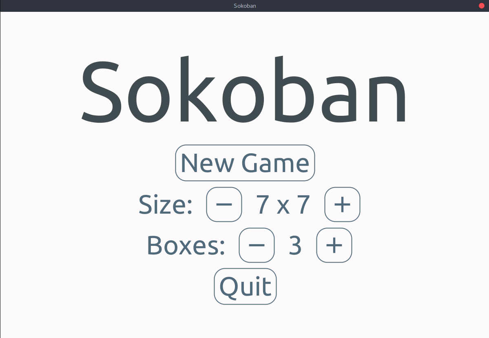
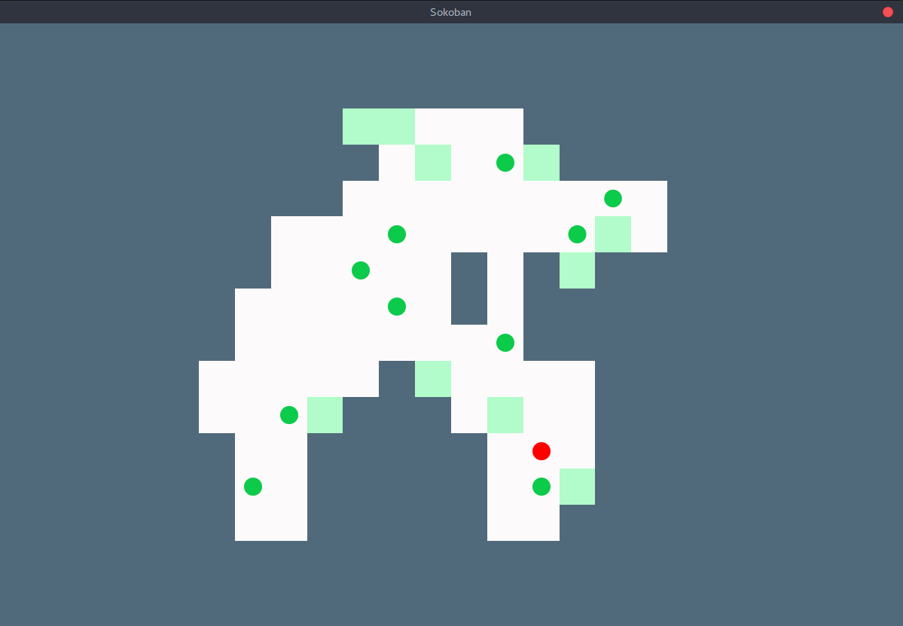

# Sokoban

## About
Sokoban (倉庫番, Sōko-ban) is a puzzle video game genre in which the player pushes crates or boxes around in a warehouse, trying to get them to storage locations. 
To read more about the original game which was an inspiration for the project visit [wikipedia](https://en.wikipedia.org/wiki/Sokoban).

<kbd>
    
</kbd>
<kbd>
    
</kbd>

### Features
- Generating random levels of different size and number of boxes.
- Possibility to reset or forfeit current level with Escape key.

### Frameworks used
- [JavaFX](https://openjfx.io/)
- [JFoenix](http://www.jfoenix.com/)
- [fontawesomefx](https://bitbucket.org/Jerady/fontawesomefx/src/master/)


## Release
   You can download Sokoban app [here](https://github.com/mateuszpach/Sokoban/releases/tag/v1.0).

## Building
1. Clone the repo.
    ```
    git clone https://github.com/mateuszpach/Sokoban
    ```
2. Build with gradle.
    ```
    cd Sokoban/
    ./gradlew runShadow
    ```
